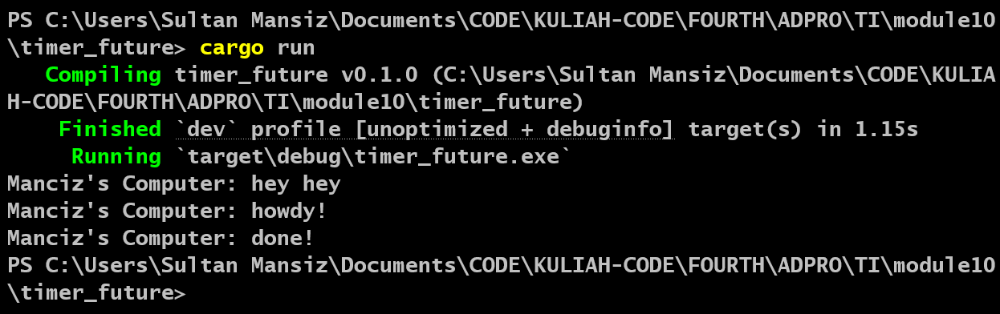

| NAME               | ID         | ADVPROG CLASS |
| ------------------ | ---------- | ------------- |
| Sultan Ibnu Mansiz | 2306275840 | B             |

# Module 10: Asynchronous Programming - Timer

## Understanding How It Works

Despite the fact that `println!()` is executed after the invocation of `spawner.spawn(async { ... });`, the string `"hey hey"` is printed prior to `"howdy!"`. This behavior occurs because asynchronous functions operate independently of the main execution flow. Consequently, the main program does not wait for the completion of the asynchronous function before continuing its execution.

The statement `println!("Manciz's Computer: hey hey");` is positioned outside the asynchronous function and is immediately executed by the main program. Meanwhile, the asynchronous function is awaiting the result from the future. As a result, `"hey hey"` is printed first, followed by the execution of the asynchronous task managed by the executor.

