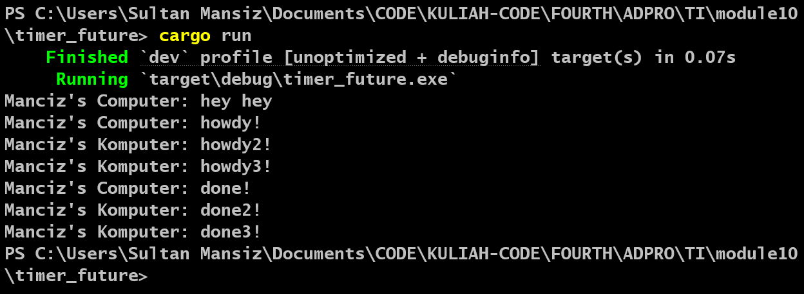
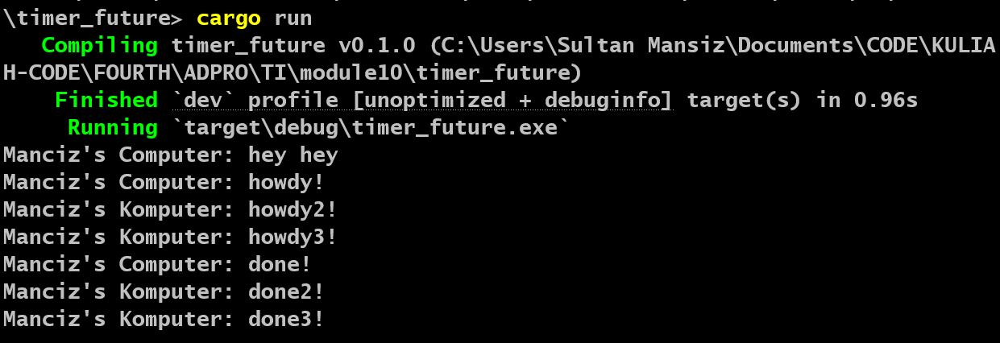

| NAME               | ID         | ADVPROG CLASS |
| ------------------ | ---------- | ------------- |
| Sultan Ibnu Mansiz | 2306275840 | B             |

# Module 10: Asynchronous Programming - Timer

## Understanding How It Works

Despite the fact that `println!()` is executed after the invocation of `spawner.spawn(async { ... });`, the string `"hey hey"` is printed prior to `"howdy!"`. This behavior occurs because asynchronous functions operate independently of the main execution flow. Consequently, the main program does not wait for the completion of the asynchronous function before continuing its execution.

The statement `println!("Manciz's Computer: hey hey");` is positioned outside the asynchronous function and is immediately executed by the main program. Meanwhile, the asynchronous function is awaiting the result from the future. As a result, `"hey hey"` is printed first, followed by the execution of the asynchronous task managed by the executor.

## Multiple Spawn
### Multiple Spawn: 

The string `"done!"` appears after `"done2!"` despite the code suggesting the opposite order because the tasks execute concurrently, meaning they run independently and do not wait for one another to complete. In the given implementation, three asynchronous tasks are spawned, each printing `"howdy!"`, awaiting a timer future for two seconds, and then printing `"done!"`, `"done2!"`, or `"done3!"`. Since these tasks run concurrently, their completion times may vary based on system scheduling and execution timing. As a result, there is no guarantee that the tasks will finish in the same order in which they were defined, leading to variations in output order.

### Removing `drop(spawner);` statement:

The `drop(spawner)` function is necessary to indicate that the spawner is no longer in use. The spawner behaves like a message queue, where each spawned task is added to the queue. When the executor starts running, it retrieves tasks from the queue and executes them. By explicitly dropping the spawner, we signal that no more tasks will be added, allowing the executor to process all remaining tasks and conclude the program execution. This ensures proper resource management and prevents the executor from indefinitely waiting for additional tasks.
